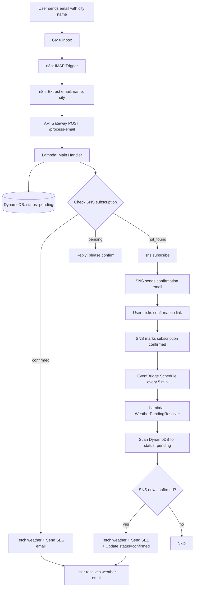

# 🌤️ Weather Notification Service (Serverless on AWS)

An end-to-end, serverless weather notification system. Users send an email with a city name; the system fetches live weather from a public API and sends back a personalized HTML weather report — with SNS double opt‑in for subscription management.

---

## 📖 Table of Contents

- [Overview](#-overview)
- [Architecture](#-architecture)
- [Features](#-features)
- [Tech Stack](#-tech-stack)
- [Prerequisites](#-prerequisites)
- [Setup Guide](#-setup-guide)
  - [1. AWS Account & IAM](#1-aws-account--iam)
  - [2. DynamoDB Table](#2-dynamodb-table)
  - [3. SNS Topic](#3-sns-topic)
  - [4. SES Setup](#4-ses-setup)
  - [5. Lambda Functions](#5-lambda-functions)
  - [6. API Gateway](#6-api-gateway)
  - [7. EventBridge Schedule](#7-eventbridge-schedule)
  - [8. n8n Workflow](#8-n8n-workflow)
- [Testing](#-testing)
- [Cost Estimate](#-cost-estimate)
- [Troubleshooting](#-troubleshooting)
- [Lessons Learned](#-lessons-learned)
- [License](#-license)

---

## 📌 Overview

This project demonstrates a real‑world, production‑grade serverless data pipeline using AWS services and n8n for orchestration. It handles:

- Email‑triggered workflows (via IMAP)
- Serverless compute (Lambda)
- NoSQL state (DynamoDB)
- Broadcast notifications with double opt‑in (SNS)
- Transactional email delivery (SES)
- Scheduled jobs (EventBridge)
- External API integration (Open‑Meteo)

The project was built as a learning exercise to understand how serverless data engineering fits together end to end.

---

## 🏗️ Architecture



### Two paths

**New user (first email):**
1. User emails the monitored address with a city name.
2. n8n extracts `email`, `name`, and `city`.
3. Lambda writes the user to DynamoDB with `status = pending`.
4. Lambda checks SNS — the email is not subscribed → calls `sns.subscribe()`.
5. SNS sends a confirmation email.
6. User clicks the link → SNS marks subscription confirmed.
7. Scheduled resolver Lambda (every 5 minutes) finds the confirmed user, fetches the weather, sends the SES email, and updates `status = confirmed`.

**Returning user (already confirmed):**
1. User emails the monitored address.
2. Lambda sees the subscription is confirmed → fetches weather and sends the email immediately.

---

## ✨ Features

- **Email‑triggered**: No UI required — users just send an email.
- **Double opt‑in via SNS**: AWS‑managed confirmation flow prevents spam and satisfies anti‑abuse best practices.
- **Personalized HTML emails**: Each recipient gets a styled report with their name and city.
- **Serverless end‑to‑end**: No EC2, no servers to manage, pay only for usage.
- **Scheduled reconciliation**: EventBridge automatically retries pending confirmations every 5 minutes.
- **Live weather data**: Powered by [Open‑Meteo](https://open-meteo.com) — free, no API key required.
- **Full audit trail**: DynamoDB tracks every subscriber with status, timestamps, and city.

---

## 🧰 Tech Stack

| Layer | Service | Purpose |
|-------|---------|---------|
| Trigger | **IMAP (GMX)** | Receives user emails |
| Orchestration | **n8n** | Watches inbox, extracts data, calls AWS |
| Entry point | **AWS API Gateway** | HTTP endpoint for n8n |
| Compute | **AWS Lambda** (×2) | Main handler + scheduled resolver |
| State | **Amazon DynamoDB** | Subscriber tracking |
| Double opt‑in | **Amazon SNS** | Subscription confirmation |
| Email delivery | **Amazon SES** | Sends weather HTML emails |
| Scheduling | **Amazon EventBridge** | Runs resolver every 5 min |
| Weather source | **Open‑Meteo API** | Geocoding + current weather |
| Monitoring | **CloudWatch** | Logs and metrics |

---

## 📋 Prerequisites

- AWS account (with permissions to create Lambda, DynamoDB, SNS, SES, API Gateway, EventBridge)
- An email account that supports **IMAP** (this project uses **GMX**)
- A running **n8n** instance (self‑hosted or cloud)
- Basic familiarity with the AWS Console
- For local testing: AWS CLI installed and configured

---

## 🚀 Setup Guide

### 1. AWS Account & IAM

**Regions used in this project:**

| Service | Region |
|---------|--------|
| Lambda, DynamoDB, SNS, API Gateway, EventBridge | `ap-southeast-4` (Melbourne) |
| SES | `ap-southeast-2` (Sydney) |

> ⚠️ **Important**: Amazon SES is **not** available in `ap-southeast-4`. The SES client in Lambda must explicitly set `region_name='ap-southeast-2'`. This is the most common source of errors when replicating this project.

**IAM Roles:**

Create two roles (or one shared role for simplicity):
- `WeatherMainLambda-role` — for the n8n‑triggered Lambda
- `WeatherResolver-role` — for the scheduled resolver Lambda

**Inline policy for both roles** (adjust ARNs to your account):

```json
{
    "Version": "2012-10-17",
    "Statement": [
        {
            "Sid": "DynamoDBReadWrite",
            "Effect": "Allow",
            "Action": [
                "dynamodb:PutItem",
                "dynamodb:GetItem",
                "dynamodb:Scan",
                "dynamodb:UpdateItem"
            ],
            "Resource": "arn:aws:dynamodb:ap-southeast-4:YOUR_ACCOUNT_ID:table/WeatherSubscribers"
        },
        {
            "Sid": "SNSCheck",
            "Effect": "Allow",
            "Action": "sns:ListSubscriptionsByTopic",
            "Resource": "arn:aws:sns:ap-southeast-4:YOUR_ACCOUNT_ID:testingSNS"
        },
        {
            "Sid": "SESSendIdentity",
            "Effect": "Allow",
            "Action": ["ses:SendEmail", "ses:SendRawEmail"],
            "Resource": [
                "arn:aws:ses:ap-southeast-2:YOUR_ACCOUNT_ID:identity/weather.demo@gmx.com"
            ]
        },
        {
            "Sid": "SESSendConfigurationSet",
            "Effect": "Allow",
            "Action": ["ses:SendEmail", "ses:SendRawEmail"],
            "Resource": "arn:aws:ses:ap-southeast-2:YOUR_ACCOUNT_ID:configuration-set/my-first-configuration-set"
        }
    ]
}
```

> ⚠️ **Why two SES statements?** `ses:SendEmail` requires permission on **both** the sender identity and the configuration set. A single statement will fail with `AccessDenied`.

---

### 2. DynamoDB Table

Create a table named `WeatherSubscribers`:

| Setting | Value |
|---------|-------|
| **Partition key** | `email` (String) |
| **Sort key** | *(none)* |
| **Capacity mode** | On‑demand |

**Attributes (added at runtime):**
- `name` — user's display name
- `city` — requested city
- `status` — `pending` or `confirmed`
- `subscribed_at` — ISO timestamp
- `confirmed_at` — ISO timestamp (set by resolver)

---

### 3. SNS Topic

Create a Standard topic named `testingSNS`. No subscribers initially — subscriptions are added automatically by the Lambda when a user emails.

---

### 4. SES Setup

**In the `ap-southeast-2` (Sydney) region:**

1. Verify your **sender identity**: `weather.demo@gmx.com`
2. (While in sandbox) verify each **recipient** you want to test with.
3. Create a **configuration set** named `my-first-configuration-set`.
4. Attach it as the default to your sender identity.
5. Configure **event destinations** (bounce / complaint) → your SNS topic (recommended).

**Request production access:**
- Once ready, submit the request in **SES → Account dashboard → Request production access**.
- Approval typically takes a few hours.

---

### 5. Lambda Functions

#### 5a. Main Lambda — `WeathertestAPIFreedemo`

**Trigger**: API Gateway (POST `/process-email`)

**Environment variables:**

| Key | Value |
|-----|-------|
| `SNS_TOPIC_ARN` | `arn:aws:sns:ap-southeast-4:...:testingSNS` |
| `DYNAMODB_TABLE` | `WeatherSubscribers` |
| `SENDER_EMAIL` | `weather.demo@gmx.com` |

**Configuration:**
- Runtime: Python 3.12+ (project tested on 3.14)
- Timeout: **30 seconds**
- Memory: **256 MB**

**Logic:**
1. Parse `{ email, name, city }` from request body.
2. Write/update user in DynamoDB (`status = pending` for new).
3. Check SNS subscription status.
4. If confirmed → fetch weather → send SES email.
5. If pending → return "please confirm".
6. If not found → `sns.subscribe()` → SNS sends confirmation.

#### 5b. Resolver Lambda — `WeatherPendingResolver`

**Trigger**: EventBridge Schedule (every 5 minutes)

**Environment variables:** same as above.

**Configuration:**
- Runtime: Python 3.12+
- Timeout: **30 seconds**
- Memory: **256 MB**

**Logic:**
1. Scan DynamoDB for `status = pending`.
2. List all SNS subscriptions.
3. For each pending user whose SNS subscription is now confirmed:
   - Fetch weather.
   - Send SES email.
   - Update `status = confirmed`.

---

### 6. API Gateway

1. Create a **REST API**.
2. Resource: `/process-email`.
3. Method: **POST**.
4. Integration: **Lambda Function** → main Lambda.
5. ✅ **Use Lambda Proxy Integration** (critical — without this, the body won't reach Lambda).
6. Deploy to a stage (`prod`).
7. Note the **Invoke URL** for n8n.

---

### 7. EventBridge Schedule

1. Go to **EventBridge → Schedules → Create schedule**.
2. Name: `WeatherPendingResolver-Every5Min`
3. Pattern: **Recurring** → **Rate-based** → `5 minutes`
4. Flexible time window: **Off**
5. Target: **AWS Lambda** → `WeatherPendingResolver`
6. Create.

---

### 8. n8n Workflow

**Nodes:**

1. **Email Trigger (IMAP)**
   - Host: `imap.gmx.com`
   - Port: `993`
   - User: `weather.demo@gmx.com`
   - Password: your GMX password (or app password if 2FA is enabled)
   - SSL/TLS: enabled

2. **Code Node** — extract `email`, `name`, `city` from the incoming email.
   ```javascript
   const rawText = $json.text || $json.textPlain || '';
   const emailText = rawText.replace(/<[^>]*>/g, ' ');

   const returnPath = ($json.metadata?.['return-path'] || '').replace(/[<>\s]/g, '');

   const patterns = [
     /weather\s+(?:in|for|of)\s+([A-Z][a-zA-Z\s\-]+?)(?:[.,!?\n]|$)/gi,
     /city\s*[:\-]\s*([A-Z][a-zA-Z\s\-]+?)(?:[.,!?\n]|$)/gi,
   ];

   let matches = [];
   for (const pattern of patterns) {
     let m;
     while ((m = pattern.exec(emailText)) !== null) {
       matches.push({ city: m[1].trim(), index: m.index });
     }
   }

   let lastCity = '';
   if (matches.length > 0) {
     matches.sort((a, b) => a.index - b.index);
     lastCity = matches[matches.length - 1].city;
   }

   return [{ json: { email: returnPath, city: lastCity } }];
   ```

3. **HTTP Request**
   - Method: **POST**
   - URL: your API Gateway invoke URL
   - Body Content Type: **JSON**
   - Body: `{ "email": "{{ $json.email }}", "city": "{{ $json.city }}" }`

**Activate the workflow.** n8n will now monitor the inbox and trigger the pipeline.

---

## 🧪 Testing

**Step 1 — Send a test email**
From any email account, send an email to the monitored GMX address with a city, e.g.:
> Subject: Weather please
> Body: What's the weather in Cairo?

**Step 2 — Check CloudWatch**
Open `/aws/lambda/WeathertestAPIFreedemo` → latest stream. Expect:
```
DynamoDB write OK for as.alnaqa@gmail.com
```

**Step 3 — Check DynamoDB**
The item `as.alnaqa@gmail.com` should appear with `status = pending`.

**Step 4 — Check SNS confirmation email**
The recipient gets a confirmation email from AWS. Click the link.

**Step 5 — Wait for the resolver**
Within 5 minutes, the resolver runs. Logs should show:
```
Found 1 pending users.
User as.alnaqa@gmail.com confirmed. Sending weather for Cairo...
User as.alnaqa@gmail.com status updated to 'confirmed'.
```

**Step 6 — Check inbox**
The weather email arrives. Check spam if not in inbox.

**Step 7 — Verify DynamoDB update**
The item's `status` should be `confirmed` with a `confirmed_at` timestamp.

---

## 💰 Cost Estimate

| Service | Free Tier | Estimated Monthly Cost (low volume) |
|---------|-----------|-------------------------------------|
| Lambda | 1M requests/month | **$0** |
| DynamoDB | 25 GB storage + 2.5M requests/month | **$0** |
| SNS | 1M publishes/month | **$0** |
| SES | 62,000 emails/month (from EC2) or $0.10/1000 | **~$0.10** |
| API Gateway | 1M calls/month (12 months) | **$0** |
| EventBridge | Free for AWS targets | **$0** |

**Total: ~$0–1/month** for a small user base.

---

## 🔧 Troubleshooting

| Error | Cause | Fix |
|-------|-------|-----|
| `InvalidAction` on `SendEmail` | Lambda defaults to `ap-southeast-4`, but SES only exists in `ap-southeast-2` | `boto3.client('ses', region_name='ap-southeast-2')` |
| `AccessDenied` on `configuration-set` | Missing separate IAM statement | Split SES permissions: identity + configuration set |
| `Task timed out` | Lambda timeout too low | Set timeout to **30 seconds** |
| `MessageRejected: Email address is not verified` | Recipient not verified in SES sandbox | Verify in SES `ap-southeast-2`, or exit the sandbox |
| Resolver always finds `0 pending users` | Main Lambda writes `status=active` instead of `pending` | Ensure main Lambda writes `status = pending` on new users |
| `502 Bad Gateway` from API Gateway | Lambda response body is a JSON object, not a string | Return `body: json.dumps(...)` |
| No email in inbox | Email marked as spam | Check spam folder; consider DKIM/SPF setup for production |

---

## 🎓 Lessons Learned

Building this project revealed several production‑grade nuances worth documenting:

1. **Cross‑region SES calls.** SES isn't available in every AWS region. When Lambda runs in a region without SES, you must pass `region_name` explicitly.
2. **Configuration sets add a hidden permission layer.** `ses:SendEmail` requires permission on **both** the identity and the configuration set — a single IAM statement is not enough.
3. **Inline IAM policies must be attached per role.** Copying policies from one role to another requires deliberate re‑attachment; orphans don't grant anything.
4. **SES sandbox restricts recipients.** In sandbox mode, SES blocks unverified recipients at the service level — not just at the IAM level.
5. **Double opt‑in needs reconciliation.** Since SNS doesn't push a "confirmed" event, a scheduled resolver is the cleanest way to detect confirmed subscriptions and send the first welcome email.
6. **Lambda timeout defaults to 3 seconds** — far too low for any workflow that calls two APIs and writes to two services. Always increase it explicitly.
7. **API Gateway's Lambda Proxy Integration requires a strict response shape.** The `body` field must be a **JSON string**, not an object.

---

## 📄 License

MIT — free to use, modify, and share.

---

## 🤝 Contributing

Pull requests are welcome. For significant changes, please open an issue first to discuss what you'd like to change.

---

**Built with**: n8n · AWS Lambda · DynamoDB · SNS · SES · API Gateway · EventBridge · Open‑Meteo
